# Clases del Curso de Matemáticas para Data Science: Probabilidad

[Slides del curso](https://static.platzi.com/media/public/uploads/slides-probabilidad-data-science_3af3bfa5-a2f6-4437-83aa-59caf778c2c7.pdf)

## ¿Qué es la probabilidad?

Axiomas de la probabilidad

- Suceso elemental
  el resultado de lanzar un dado es 4

- Suceso
  El resultado de lanzar un dado es par

$
P = \frac{N° sucesos exitosos}{N° sucesos totales}
$

### RESUMEN: ¿Qué es probabilidad?

La probabilidad es una creencia que tenemos sobre la ocurrencia de eventos elementales.

¿En qué casos usamos la probabilidad?

Intuitivamente, hacemos estimaciones de la probabilidad de que algo ocurra o no, al desconocimiento
que tenemos sobre la información relevante de un evento lo llamamos incertidumbre.

El azar en estos términos no existe, representa la ausencia del conocimiento de todas
las variables que componen un sistema.

En otras palabras, la probabilidad es un lenguaje que nos permite cuantificar la incertidumbre

#### AXIOMAS:

Es un conjunto de sentencias que no son derivables de algo más fundamental. Las damos por verdad
y no requieren demostración.

“A veces se compara a los axiomas con semillas, porque de ellas surge toda la teoría”
Axiomas
AXIOMAS DE PROBABILIDAD :

La probabilidad está dada por el número de casos de éxito sobre la cantidad total(teórica) de casos.

P = #-Casos de éxito/ # Casos-totales.

Suceso elemental: Es una única ocurrencia, “Solo tienes una cara de la moneda como resultado”

Sucesos: Son las posibilidades que tenemos en el sistema. Está compuesto de sucesos elementales,
por ejemplo, “El resultado de lanzar un dado es par”, hay tres sucesos (2,4,6) que componen este enunciado.

De la interpretación del axioma anterior divergen dos escuelas de pensamiento. Frecuentista y Bayesiana

Ejemplo: “Solo tengo dos posibles resultados al lanzar una moneda, 50% de probabilidad para cada cara
, (1/2 y 1/2), si lanzo la moneda n veces, la moneda no cae la mitad de las veces en una cara, y luego la otra”

Esta equiprobabilidad de ocurrencia en un espacio muestral ocurre bajo el supuesto de que
la proporción de exitos/totales tiende a un valor p. En otras palabras, solo lanzando la moneda
infinitas veces podemos advertir que el valor de la probabilidad es cercano a (1/2 o 50%).
Escuela frecuentista

“Toda variable aleatoria viene descrita por el espaci muestral que contiene todos los posibles sucesos
de ese problema aleatorio.”

La probabilidad que se asigna como un valor a cada posible suceso tiene varias propiedades por cumplirse

#### PROPIEDADES AXIOMAS:

0 <= P <= 1
Certeza: P = 1
Imposibilidad P = 0
Disyunción P(AuB) = P(A) +P(B)

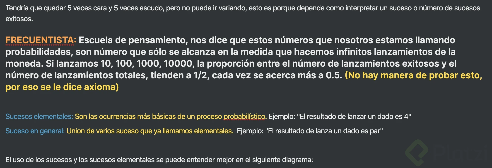
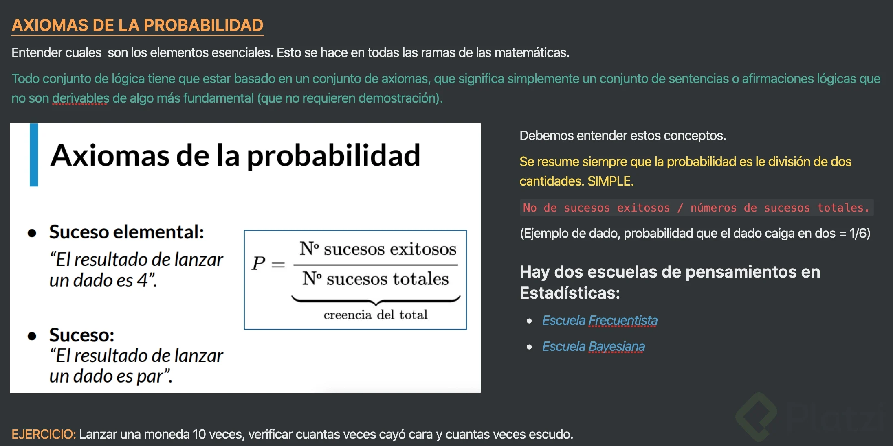
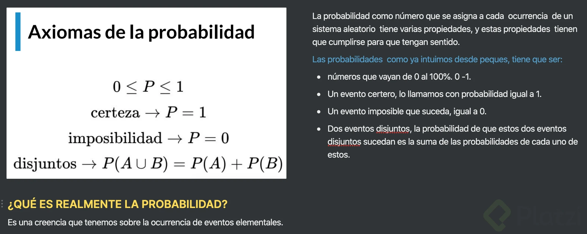

## Probabilidad en machine learning

¿Cuáles son las fuentes de incertidumbre?

- Datos: Debido a que nuestros instrumentos de medición tienen un margen de error, se presentan datos imperfectos e incompletos, por lo tanto hay incertidumbre en los datos.
- Atributos del modelo: Son variables que representan un subconjunto reducido de toda la realidad del problema, estas variables provienen de los datos y por lo tanto presentan cierto grado de incertidumbre.
- Arquitectura del modelo: Un modelo en mates es una representación simplificada de la realidad y al ser así, por construcción, induce otra capa de incertidumbre, ya que al ser una representación simplificada se considera mucho menos información.

Y claro, todo esta incertidumbre se puede cuantificar con probabilidad:

Ejemplo, un clasificador de documento de texto:

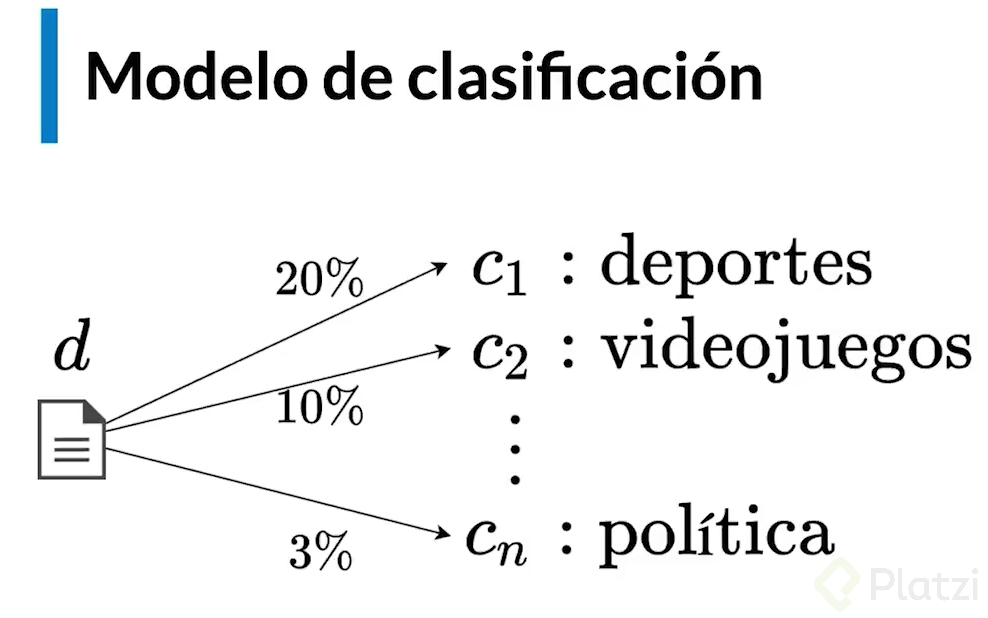

Entonces, el modelo asignara cierta probabilidad a cada documento y así de determinara la clasificación de los documentos.

Pero, ¿cómo funciona por dentro nuestro modelo de clasificación?

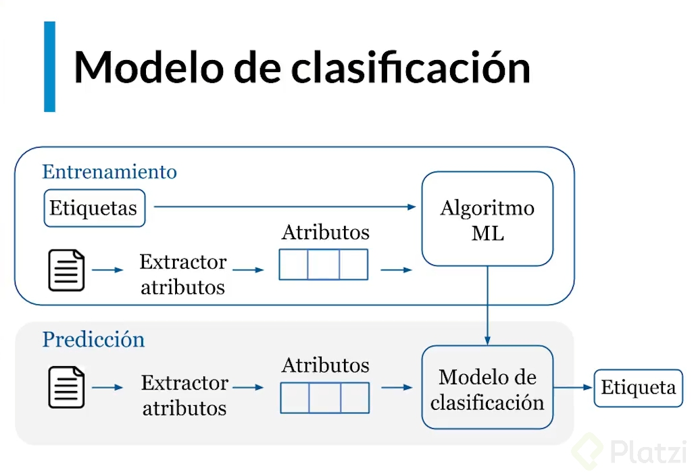

So, ¿En dónde se aplica la probabilidad?

Bueno, en realidad no todos los modelos probabilístico, a la hora de diseñarlo nosotros elegimos sui queremos que sea un modelo probabilístico o no.

Por ejemplo si escogemos el modelo de Naive Vayes, luego de que escogemos el diseño ahora definimos el entrenamiento y este es básicamente que el modelo aprenda el concepto de distribución de probabilidad y es una manera que yo uso para saber que probabilidades le asigno una de las posibles ocurrencias de mis datos, de ahí sirgue el esquema MLE que es el estimador de máxima verosimilitud y luego de esto esta la calibración se configuran los hiper-parámetros, esto se entiende mas en redes neuronales artificiales en donde el numero de neuronas de una capa tiene 10 neuronas y cada una tiene sus propios pesos que conectan a las neuronas, entonces esos pesos los podemos ir calibrando para que el modelo sea cada vez mas pequeño. Sin embargo, hay parámetros están fuera del modelo y no se pueden calibrar y a esos parámetros les llamamos hiper-parámetros, porque están fuera de todo ese esquema de optimización. Al final se hace la optimización de los hiper parámetros. Y al final tenemos la interpretación, para interpretar hay veces que se tiene que saber el funcionamiento del modelo y aplicar conceptos de estadística para poder interpretarlo.

## Tipos de probabilidad

- Conjunta (joint)
- Marginal
- Condicional

Regla del producto

$$
P(A,B) = P(A | B) * P(B)
$$

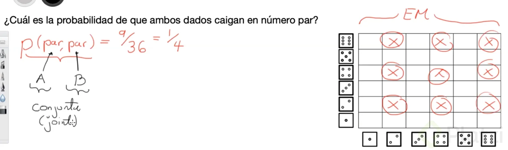

Esta probabilidad de un suceso, en realidad corresponde a 2 sucesos separados y cuando yo calculo la probabilidad de 2 o mas sucesos, a eso es a lo que se le llama probabilidad conjunta.

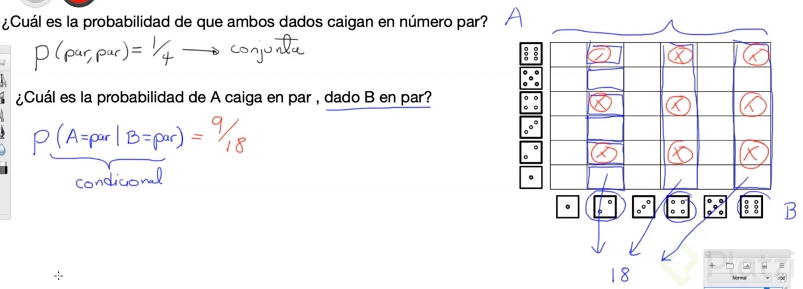

La condición de “dado B en par”, lo que hizo fue restringir y paso de tener 36 posibilidades a ahora tener 18 ocurrencias distintas. Y como la probabilidad de A depende de B, entonces la llamamos probabilidad condicional.
Ya ahora para calcular la probabilidad, nos damos cuenta que el numero de eventos exitosos no cambio, si no que lo que cambio fue el numero de eventos posibles.

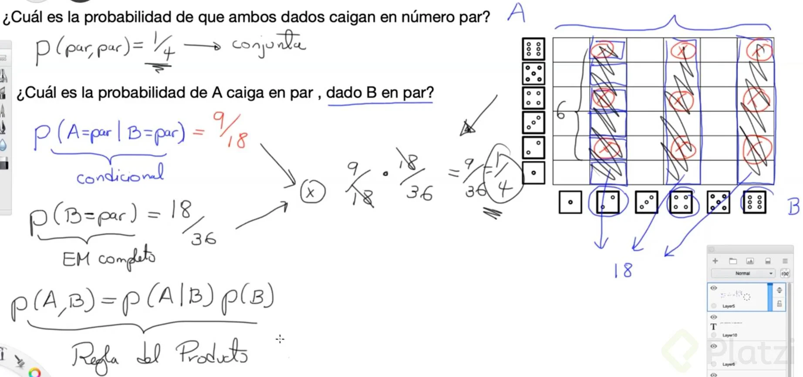

Ahora, nos vamos a reformular le pregunta. ¿cuál es la probabilidad de que el dado B caiga en par?
Aquí no se impone ninguna condición y yo puedo usar todo el espacio muestral completo. De la misma manera tengo 36 opciones y de esas 36 opciones, ¿cuantas corresponder al dado b en par? Son 18.
Ahora si multiplico 9/18 * 10/36 = 1/4 y da exactamente la probabilidad conjunta.
Por lo tanto, la probabilidad conjunta de que suceda A y B es igual a la probabilidad condicional de que suceda A dado que ya sé que sucedió B, por la probabilidad de que suceda B. Esto la resultado a la regla del producto..

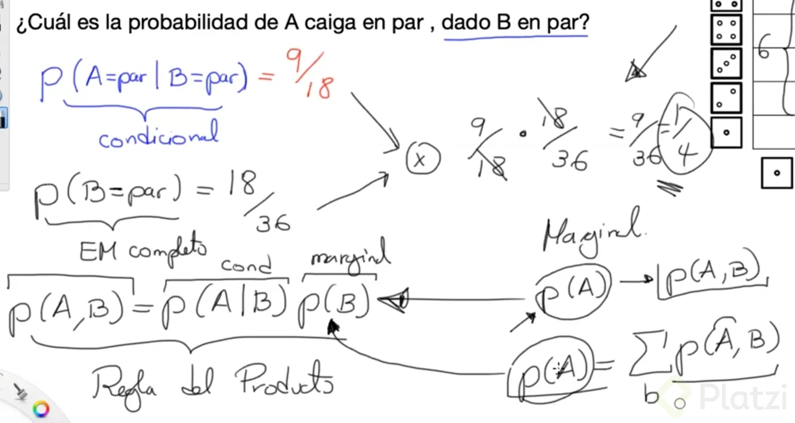

Ahora, ¿qué es la probabilidad marginal?

Es cuando se obtiene una probabilidad sencilla a partir de una probabilidad conjunta. Es decir cuando se tiene las probabilidades conjuntas de 2 sucesos y se quiere saber solo la probabilidad de que suceda el primer suceso independiente de lo que pasa con el otro, así eso se define como la suma de todas la probabilidades conjuntas sobre los demás estados que no está considerando A.

La probabilidad marginal es la misma probabilidad de la regla del producto, pero la relación fundamental siempre será la regla del producto.

## Ejemplos de cálculo de probabilidad

### Correlaciones de eventos

- A = { el resultado de lanzar un dado es 4}

- B = {el resultado de lanzar un dado es par}

- C = {el resultado de lanzar un dado es impar}

$A = \frac{1}{6}$

$B = \frac{3}{6}$

$P(A|B) = \frac{1}{3}$

en base a esto se puede decir que A y B estan positivamente correlacionados

$P(A|C) = \frac{0}{3} = 0$

A y C estan negativamente correlacionados
Por lo cual son eventos exclutentes y dependientes

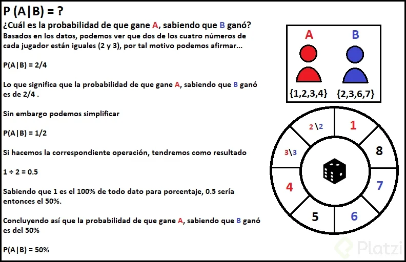

### Reto

Si el jugador 1 escoge {1,2,3,4} de las 8 opciones y el jugador 2 escoge {2,3,6,7} la probabilidad de que el jugador 2 gane dado que gano el jugador 1 es: $P(1|2) = \frac{1}{2} = 0.5$

## Ejemplos avanzados con probabilidad

### Paradoja ¿niño o niña?

1- Una mujer tiene dos bebes el mayor es varon
2- Una mujer tiene dos bebes donde uno de ellos es varon

¿Cual es la probabilidad de esta mujer que tenga dos hijos varones?

|     | F   | M   |
| --- | --- | --- |
| M   | FM  | MM  |
| F   | FF  | MF  |

sin condiciones

$$
P(MM) = 1/4
$$

Para la situacion 1 la probabilidad seria

$$
P(MM | Mayor M) = 1/2
$$

Para la situacion 2 la probabilidad seria

$$
P(MM | alguno es M) = 1/3
$$

### El problema de Monthy hall

Se tienen 3 puertas y detras de una de ellas hay un premio

| P1  | P2  | P3  |
| --- | --- | --- |
| X   | X   | o   |
| X   | o   | X   |
| o   | X   | X   |

Cada desicion tiene una probabilidad de ganar de 1/3

Se abre la puerta 3 y no tiene premio

| P1    | P2    | P3    |
| ----- | ----- | ----- |
| ~~X~~ | ~~X~~ | ~~o~~ |
| X     | o     | X     |
| o     | X     | X     |

Al descartar una puerta el espacio muestral cambia y tambien la probilidad de escoger la puerta correcta cambio y ahora es de 1/2

Explicacion del razonamiento

dado que se escogiera la puerta 1 en la primera ronda

| P1  | P2  | P3  | stay | switch |
| --- | --- | --- | ---- | ------ |
| X   | X   | o   | X    | o      |
| X   | o   | X   | X    | o      |
| o   | X   | X   | o    | X      |

Es mas probable ganar al cambiar de puerta en la segunda ronda ya que el nuevo espacio muestral cambiar de puerta te da mas probabilidades de ganar.
Eso se basa a que en la primera ronda habia 2/3 = 0.66 de probabilidad de escoger la puerta equivocada y por ello en la segunda ronda hay 2/3 de probabilidad de que al cambiar de puerta se escoja la puerta correcta

## ¿Qué es una distribución?

X aleatoria -> $P(X = x)$

Siendo la probabilidad de ocurrencia

$$
P = f(X)
$$

$X$ -> variable aleatoria

$x$ -> valores posibles en el espacio muestral

Dominios discretos o cuntinuos

Discreto ${1,2,3,4,5,6}$

Continuo $[0, \infty]$

Funcion de probabilidad acumulada
$$
P(x \leq X) = \int_{X \leq x}^{} P(x)dx =C(x)
$$

Al acerlo con probabilidad discreta se hace con sumas discretas

Funcion de probabilidad acumulada para funciones discretas

$$
P(X \leq x) = \sum_{X \leq x} P(X)
$$

### Reto

Cual es la probabilidad de la variable aleatoria tome un valor entre dos umbrales

$$
P(a \leq x \leq b) = \int_{a}^{b} F(x)dx = F(b) - F(a) = C(x)
$$

## Distribuciones discretas

### Distribución de Bernoulli

Variables con ocurrencias binarias

Lanzamiento de monedas

P(X = 1) = p

P(X = 0) = 1 - p

### Distribución binomial

Secuencia repetitiva de eventos tipo Bernoulli

Teniendo n lanzamientos de monedas

Cual es la probabilidad de tener k caras

P(2 caras| 3 lanzamientos) = 3/8

P(k caras| n lanzamientos) = ?

**Ejemplo:** con 3 lanzamientos obtener k caras

- Probabilidad de tener 0 caras = 1/8
- Probabilidad de tener 1 cara = 3/8
- Probabilidad de tener 2 caras = 3/8
- Probabilidad de tener 3 caras = 1/8

$$
P(k, n) = ?
$$

### Combinatorio

Candidad de n formas posibles de combinar un elemento k veces

$$
{\displaystyle C_{n}^{k}={\binom {n}{k}}={\frac {n!}{k!(n-k)!}}}
$$

o

$$
{\displaystyle C_{n}^{p}={\binom {n}{p}}={\frac {n!}{p!(n-p)!}}}
$$

p -> suceso -> #estados del suceso * p

### Distribucion binomial

$$
P(k caras | n lanzamientos) = P(k;n,p)
$$

$$
P(k;n,p) = {\binom {n}{k}}p^k(1-p)^{(n-k)}
$$

### Distribucion multinomial

$$
P(X_1, ...,X_n) = \frac{n!}{k_1!...k_2!}p_1^{k_1}...p_n^{k_n}
$$

### Otras distribuciones

- Poisson
- Geométrica
- Hipergeométrica
- Binomial negativa
- ...

### Otras Notas

Propiedades de una distribución binomial:

Los sucesos son colectivamente exhaustivos, es decir, al menos uno de los 2 ha de ocurrir. Si no se es hombre, se es mujer y, si se lanza una moneda, si no sale cara ha de salir cruz.

La variable aleatoria que sigue una distribución binomial se suele representar como X~(n,p), donde n representa el número de ensayos o experimentos y p la probabilidad de éxito.

Los sucesos son mutuamente excluyentes, es decir, no pueden ocurrir los 2 al mismo tiempo. No se puede ser hombre y mujer al mismo tiempo o que al lanzar una moneda salga cara y cruz al mismo tiempo.

## [C11] ¿Qué es MLE?

Maximum Likelihood Estimation
Estimacion de Maxima Verosimilitud

- Escoger la distribución
  Teniendo solo una muestra de los datos

- Escoger los parametros de la distribucion
  Que mejor ajustan la distribucion a los datos

**Un problema de optimización**
$$
P(X;\theta) = L(X;\theta)
$$

$$
\max L(X;\theta) \rightarrow \max \prod_i P(X_i;\theta)
$$

$$
\max \log L(X;\theta) \rightarrow \max \sum_{i=1}\log P(X_i;\theta)
$$

### Otras notas

Les dejo un artículo de Towards Data Science escrito por Johnny Brooks-Bartlett muy fácil de digerir y que complementa muy bien la introducción del profe Francisco: [Probability concepts explained: Maximum likelihood estimation](https://towardsdatascience.com/probability-concepts-explained-maximum-likelihood-estimation-c7b4342fdbb1)

[Un vídeo para una demostración gráfica del MLE](https://www.youtube.com/watch?v=XepXtl9YKwc&t=87s)

[Explicacion](https://economipedia.com/definiciones/estimacion-de-maxima-verosimilitud.html)

## MLE en machine learning

ML no supervisado

- Clusterizacion

ML supervisado

- Clasificacion
- Regresion

### Regresion lineal con MLE

m: pendiente

b: intercepto

$b_0$: weight

$b_1$: bias

$$
y = m x + b = b_0 x + b_1
$$

h: modelo

$$
P(x|y) \rightarrow \max \sum_i \log P(y_i|x_i;h)
$$

$$
h \rightarrow y = b_0x + b_1
$$

$$
P \rightarrow \frac{1}{\sigma \sqrt{2\pi}} \exp -\frac{1}{2}(\frac{X - \mu}{\sigma})^2
$$

### minimos cuadrados

Lo comun de mostrar la regresion lineal es con el metodo de los minimos cuadrados

$$
\min \sum_i (y_i - (m * x_i + b ))^2
$$

en el cual se busca opmizar para el valor minimo de la suma de los errores

### Estimacion de maxima verosimilitud

$$
\max \{ \sum_i \log P(y_i, x_i; h) \} = \max \{ \sum_i \log((\frac{1}{\sigma * \sqrt{2\pi}})*e^{-\frac{1}{2}*(\frac{y_i - (m x_i +b)}{\sigma})^2}) \}
$$

considerando
$$
\log(a*b) = \log(a) + \log(b)
$$

$$
\max \{ \sum_i \log (\frac{1}{\sigma \sqrt 2 \pi}) + \sum_i \log(e * (-\frac{1}{2}) (\frac{y_i - (m * x_i + b)}{\sigma})^2) \}
$$

el primer termino $\sum_i \log (\frac{1}{\sigma \sqrt 2 \pi})$ se puede despreciar para la optimización ya que representa un valor constante

y al ser $e(x)$ y $\log (x)$ operaciones inversas nos queda la siguiente formula

$$
\max \{ \sum_i (-\frac{1}{2}) (\frac{y_i - (m * x_i + b)}{\sigma})^2  \}
$$

para quitar el signo negativo se cambia al minimo

porque **El maximo de numeros negativos es equivalente al minimo de esos mismos numeros pero en valor absoluto** entonces:

$$
\min\{\frac{1}{2 \sigma^2} * \sum_i (y_i - (m * x_i + b))^2 \}
$$

Por lo tanto el problema de la regresion lineal es tambien la estimacion de una densidad de probabilidad sobre un conjunto de datos

### Otras Notas

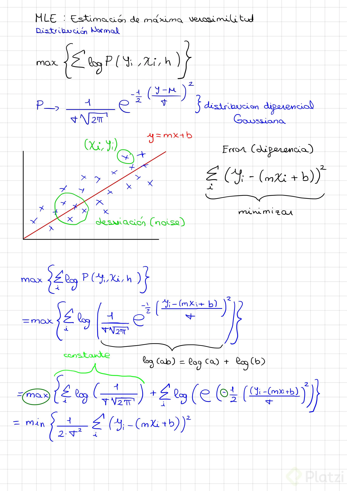

## Regresión logística

Estimacion de maxima verosimilitud

Resuelve problemas de clasificación

Se tiene un conjunto de Atributos X_n

y en base a esos atributos se les busca calcular una combinacion lineal en la cual a cada atributo se le asigna un peso "beta" a cada uno,

en otras palabras se realiza una sumatoria de todos los atributos donde cada atributo individual es multiplicado por un peso diferente

para que a la hora de clasificarlos con la regresion logistica, los valores se aproximen lo mas posible a un valor de 0 o 1 en la curva

por lo cual los valores que se buscan optimizar son los pesos con los cuales los resultados de la sumatoria sean valores lo mas cercanos a 1 o lo mas cercanos a 0 posible

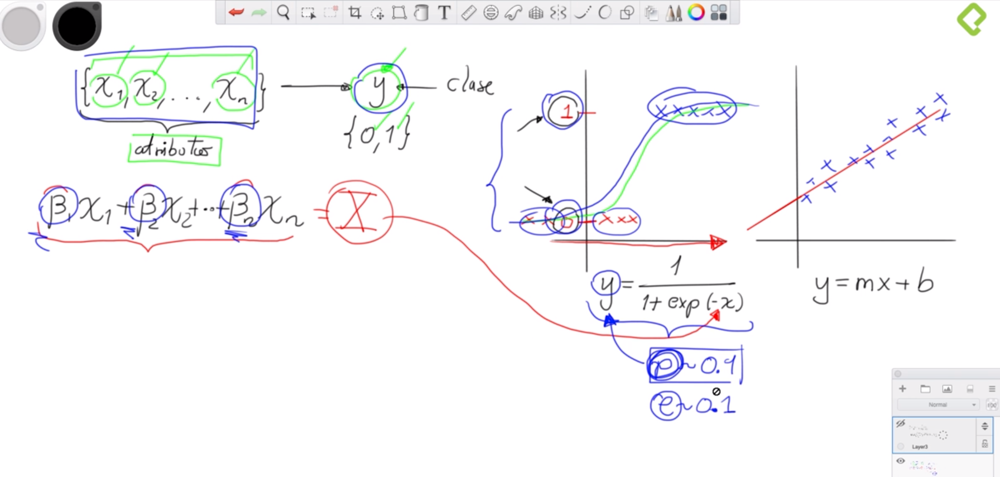

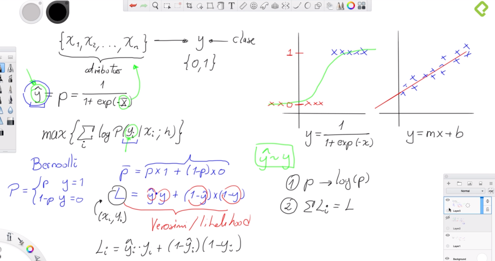

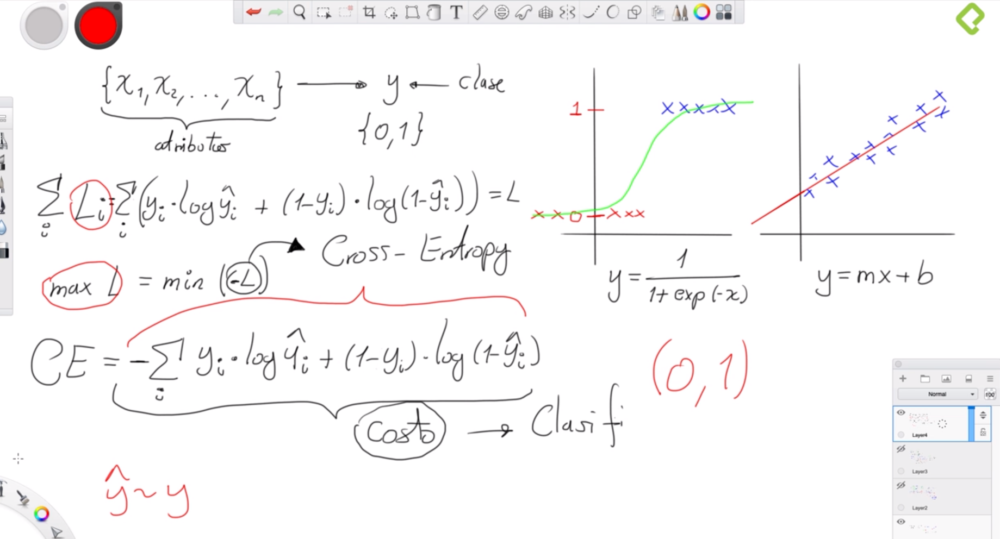

### Notas alumnos

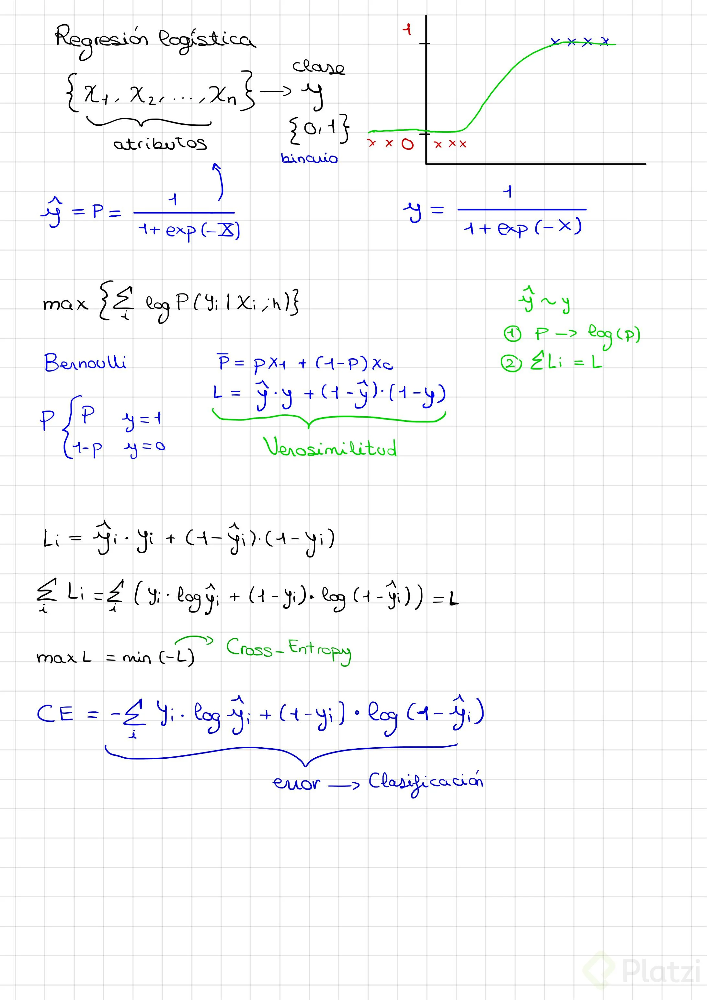
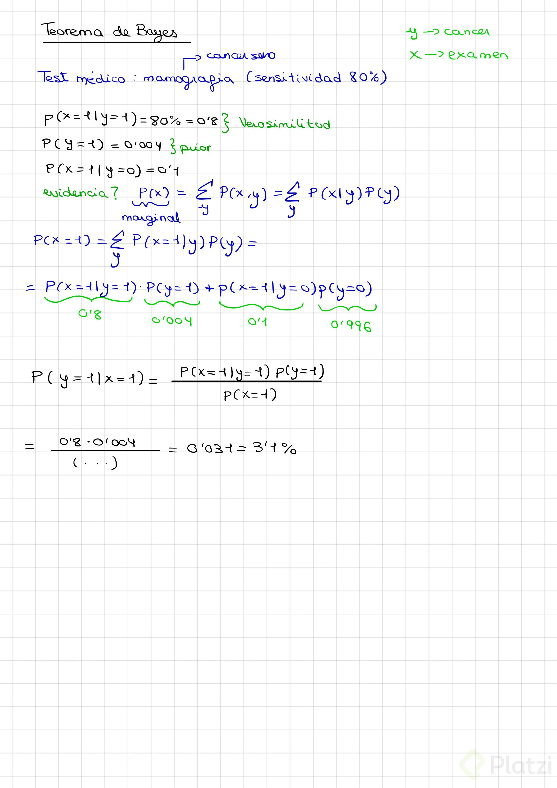

## [C15] Teorema de Bayes

$$
P(A\mid B)=\frac {P(B\mid A) \cdot P(A)}{P(B)}
$$

$A, B$ = events
$P(A\mid B)$ = probability of A given B is true
$P(B\mid A)$ = probability of B given A is true
$P(A), P(B)$ = the independent probabilities of A and B

$P(B)$ = Evidencia

$P(B\mid A)$ = verosimilitud

$P(A)$ = Priori

$P(A\mid B)$ = posteriori

Ejemplo:

Test Médico: mamografía (sensitividad 80%)

La sentividad de 80% se refiere que sabiendo que se tiene cancer la maquina tiene un 80% de probabilidad de detectar el cancer

$$
\begin{cases}
y \rightarrow cancer\\
x \rightarrow examen
\end{cases}
$$

Probabilidad de que la maquina de positivo teneniendo cancer
$P(x=1 \mid y = 1) = 80\% = 0.8$   Verosimilud

La crencia inicial de tener cancer sin ningun tipo de sintomas o conocimiento previo

$P(y = 1) = 0.004$  Prior

Probabilidad de un falso positivo

$P(x=1 \mid y=0) = 0.1$$

Con Bayes calculamos
La Probabilidad de tener cancer dado que la maquina dio positivo
$$
P(y=1\mid x=1)=\frac {P(x=1 \mid y=1) \cdot P(y=1)}{P(x=1)}
$$

Cual es la Evidencia ?

Es la probabilidad de X

la probabilidad marginal seria

$$
P(X) = \sum_y P(x,y)
$$

considerando la regla del producto

$$
P(x) = \sum_y P(x \mid y) \cdot P(y)
$$

$$
P(x=1) = \sum_y P(x=1 \mid y) \cdot P(y)
$$

$$
P(x=1) = P(x=1 \mid y = 1) \cdot P(y=1) + P(x=1 \mid y = 0) \cdot P(y=0)
$$

$$
P(x=1) = 0.8 \cdot 0.004 + 0.1 \cdot 0.996
$$

$$
P(x=1) = 0.8 \cdot 0.004 + 0.1 \cdot 0.996
$$

$$
P(x=1) = 0.1028
$$

Entonces esta probabilidad posterior es igual a

$$
P(y=1 \mid x=1) = \frac{0.8 \cdot 0.004}{0.1028} = 0.031 = 3.1\%
$$

La probabilidad de tener cancer si el examen da positivo sin tener ningun tipo de sintoma previo es del 3.1%

## Bayes en machine learning

Donde
h = hipotesis
D = Datos

Dado un conjunto de datos cual es la probabilidad de tener una hipotesis que describa ese conjunto de datos

$$
P( h \mid D) = \frac{P(D \mid h) \cdot P(h)}{P(D)}
$$

$$
\max P(h \mid D) \rightarrow \max P(D \mid h)P(h)
$$

optimizar la probabilidad de los datos/evidencia se desprecia ya que siempre sera la misma probabilidad

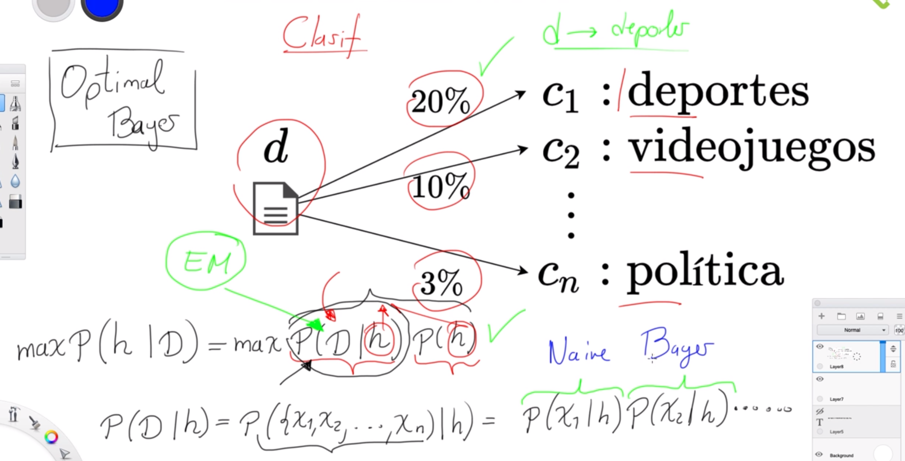

En machine learning ya que el especio muestral (conjunto de datos) suele ser demasiado grande como para poder calcular las probabilidades con todo el espacio muestral

si se llega a calcular la probabilidad con todo el espacio muestral se define al modelo como **Optimal Bayes**

Lo que se suele hacer para no tomar todo el espacio muestral es calcular la probabilidad por separado de cada punto del espacio muestral y calcular el producto de todas estas probabilidades. Los modelos de este tipo se definen como **Naive Bayes**
